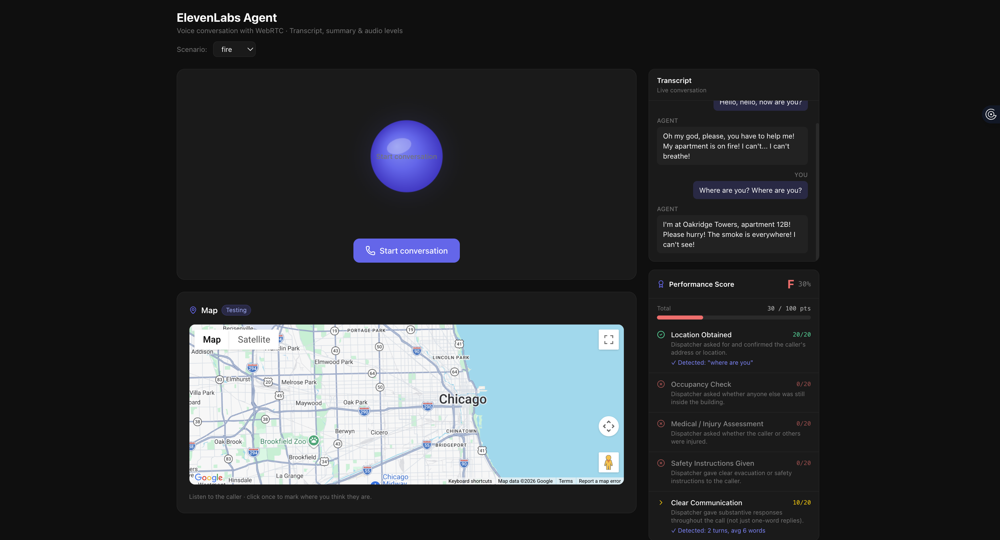

# SafeCall: Emergency Dispatch Simulator



SafeCall is a web-based, real-time voice simulator designed for training and testing emergency dispatchers. It uses the **ElevenLabs Conversational AI API** to create dynamic, voice-driven emergency scenarios (like fire emergencies) and automatically evaluates the dispatcher's performance based on their responses.


## Features

- **Real-time Voice Conversation:** Uses ElevenLabs Conversational AI over WebRTC for low-latency, natural voice interactions with an AI "caller".
- **Dynamic Scenarios:** Inject dynamic variables (e.g., caller name, emergency type, location) into the AI agent to instantly switch between different training scenarios (Fire, Medical, Robbery, etc.).
- **Live Transcript & Audio Visualization:** View the conversation transcript in real time, alongside an audio visualizer for mic input/output levels.
- **Automated Grading System:** Parses STT (Speech-to-Text) transcripts to grade dispatchers based on a custom rubric:
  - Did they ask for the location?
  - Did they check for building occupancy?
  - Did they assess medical injuries?
  - Did they give proper safety/evacuation instructions?
  - Did they communicate clearly (measuring turns and verbosity)?
- **Geospatial Pinpointing (Google Maps Integration):** Listen to the caller's location, drop a pin on a Google Map, and receive a score based on the Haversine distance to the actual target. Includes specific behaviors for "Training" (multiple attempts with best score tracking) and "Testing" (single locked guess).

## Tech Stack

- **Frontend:** React.js, TypeScript, Vite
- **Styling:** Tailwind CSS v4, Lucide React (icons)
- **AI / Voice:** `@elevenlabs/react` (ElevenLabs Conversational AI)
- **Maps / Location:** `@vis.gl/react-google-maps` (Google Maps Platform)

## Prerequisites

To run this application, you need the following API keys:

1. **ElevenLabs Agent ID:** Create a Conversational AI agent in the [ElevenLabs Dashboard](https://elevenlabs.io/app/conversational-ai).
2. **Google Maps API Key:** Create a project in the [Google Cloud Console](https://console.cloud.google.com/) and enable the **Maps JavaScript API**.

## Getting Started

1. **Clone the repository:**
   ```bash
   git clone https://github.com/yourusername/elevenlabs-agent-app.git
   cd elevenlabs-agent-app
   ```

2. **Install dependencies:**
   ```bash
   npm install
   ```

3. **Environment Setup:**
   Create a `.env` file in the root directory and add your API keys:
   ```env
   VITE_ELEVENLABS_AGENT_ID=your_elevenlabs_agent_id_here
   VITE_GOOGLE_MAPS_API_KEY=your_google_maps_api_key_here
   ```

4. **Start the development server:**
   ```bash
   npm run dev
   ```

5. **Open the app:**
   Navigate to `http://localhost:5173` in your browser.

## Project Structure

- `src/pages/start/` - Landing page.
- `src/pages/training/` - Training mode (review transcripts, practice map pinpointing).
- `src/pages/testing/` - Testing mode (live conversation with AI, automated scoring, single-guess map).
- `src/components/MapPanel.tsx` - Google Maps integration for distance calculation and UI.
- `src/components/ScorePanel.tsx` - Evaluation engine scoring the transcript.
- `src/components/TranscriptPanel.tsx` - Live transcript UI.
- `src/scenarios.ts` - Scenario configurations and target locations.


## License

This project is open-source and available under the [MIT License](LICENSE).
